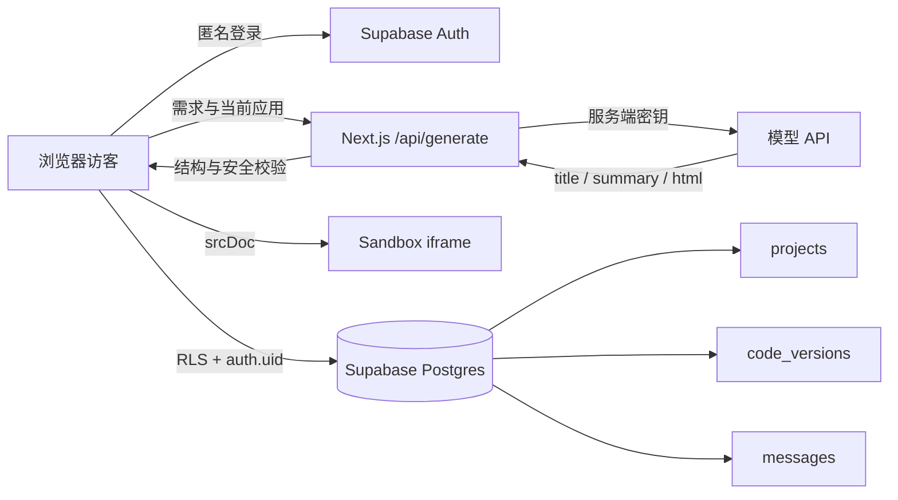

# Orbit — AI App Studio

Orbit 是一个轻量 AI 网页应用生成工作台。访客输入自然语言需求后，服务端真实调用大模型生成一份完整的单文件 HTML，并在右侧沙箱中立即运行。访客可以继续对话修改应用，Supabase 会保存项目、消息和每个不可变代码版本。

> 在线 Demo：[https://orbit-ai-app-studio.vercel.app](https://orbit-ai-app-studio.vercel.app)
>
> 源代码：[https://github.com/jeffryesboris-eng/orbit-ai-app-studio](https://github.com/jeffryesboris-eng/orbit-ai-app-studio)

## 功能完成度

- 真实模型生成：首次生成和后续修改共用 `/api/generate`。
- 结构化输出：模型返回 `title`、`summary` 和 `html`，服务端使用 Zod 与 HTML 安全规则复核。
- 可交互预览：生成的按钮、输入、筛选和计算逻辑在 iframe 中实际运行。
- 安全隔离：预览使用 `srcDoc` 与 `sandbox="allow-scripts"`，不包含 `allow-same-origin`。
- 匿名使用：首次访问自动创建 Supabase 匿名身份，无需注册。
- 云端持久化：保存项目、成功对话、当前版本指针和完整历史代码。
- 多轮修改：每次成功修改生成一个新的不可变版本。
- 版本恢复：可查看所有历史版本并恢复；恢复不会覆盖历史代码。
- 失败保护：模型失败、超时或输出不合格时保留最后一个可用预览，并提供重试。
- 资源保护：限制输入、请求体、模型输出、HTML 长度、调用时间和单实例请求频率。
- 响应式工作台：支持桌面与手机布局、桌面/手机预览切换、代码查看与复制。

支付、多人协作、复杂第三方登录、在线容器和第三方生成依赖不在当前范围内。

## 架构



模型密钥只由服务端 Route Handler 读取。浏览器只持有 Supabase Project URL 和 Publishable key，实际数据访问由匿名用户 JWT 与 RLS 共同约束。

## 技术栈

- Next.js 16、React 19、TypeScript
- Tailwind CSS 4
- Supabase Auth、Postgres、RLS、数据库函数
- Zod
- OpenAI Responses API，或 DeepSeek/OpenAI 兼容 Chat Completions API
- Vercel

## 本地运行

要求 Node.js 22.13 或更高版本。

```bash
npm ci
```

复制 `.env.example` 为 `.env.local`，填写以下变量：

```env
OPENAI_API_KEY=服务端模型密钥
OPENAI_MODEL=模型名称
NEXT_PUBLIC_SUPABASE_URL=https://项目编号.supabase.co
NEXT_PUBLIC_SUPABASE_PUBLISHABLE_KEY=sb_publishable_...
```

可选变量：

```env
# OpenAI 兼容服务地址；DeepSeek 模型名会自动选择官方地址
OPENAI_BASE_URL=

# responses 或 chat-completions；通常留空即可
MODEL_API_STYLE=
```

检查环境变量格式。脚本只显示检查结果，不输出密钥：

```bash
npm run check:env
```

启动开发服务：

```bash
npm run dev
```

默认访问 <http://localhost:3000>。

## 初始化 Supabase

1. 在 [Supabase Dashboard](https://supabase.com/dashboard) 创建项目。
2. 进入 **Authentication → Sign In / Providers**，开启 **Allow anonymous sign-ins**。
3. 进入 **SQL Editor → New query**，完整执行 `supabase/schema.sql`。
4. 从项目的 **Connect** 面板复制 Project URL 和 Publishable key，写入 `.env.local`。
5. 重启开发服务，页面应显示“云端已同步”。

应用不需要数据库密码、Secret key 或 `service_role` key。`supabase/schema.sql` 会创建：

- `projects`：项目元数据与当前版本指针。
- `messages`：成功生成和恢复产生的对话记录。
- `code_versions`：每次成功生成的完整不可变版本。
- `save_generation`：以单个事务写入消息、版本并更新项目。
- `restore_version`：校验归属后切换当前版本并记录恢复消息。
- RLS 策略：三张表只允许当前 `auth.uid()` 访问自己的数据。

## 模型配置

默认使用 OpenAI Responses API 和严格 JSON Schema。模型名以 `deepseek-` 开头时，应用会自动使用 DeepSeek 官方地址、Chat Completions 和 JSON Object 模式。

其他 OpenAI 兼容服务可以同时设置：

```env
OPENAI_BASE_URL=https://服务地址
MODEL_API_STYLE=chat-completions
```

接口会拒绝结构不完整、HTML 过长、引用外部资源、包含网络请求或危险嵌入能力的结果。

## 部署到 Vercel

### 使用 Vercel Dashboard

1. 将项目推送到一个公开 GitHub 仓库。
2. 在 [Vercel](https://vercel.com/new) 导入该仓库。
3. Framework Preset 保持 **Next.js**，Build Command 保持 `next build`。
4. 在 **Environment Variables** 中添加：

   | 变量 | 环境 | 说明 |
   | --- | --- | --- |
   | `OPENAI_API_KEY` | Production / Preview | 服务端密钥，必须保密 |
   | `OPENAI_MODEL` | Production / Preview | 模型名称 |
   | `OPENAI_BASE_URL` | 按需 | 兼容服务地址 |
   | `MODEL_API_STYLE` | 按需 | `responses` 或 `chat-completions` |
   | `NEXT_PUBLIC_SUPABASE_URL` | Production / Preview | Supabase Project URL |
   | `NEXT_PUBLIC_SUPABASE_PUBLISHABLE_KEY` | Production / Preview | Supabase Publishable key |

5. 点击 **Deploy**。以后修改环境变量后需要重新部署，`NEXT_PUBLIC_` 变量会在构建时写入浏览器包。

### 使用 Vercel CLI

```bash
npx vercel@latest link
npx vercel@latest env add OPENAI_API_KEY production
npx vercel@latest env add OPENAI_MODEL production
npx vercel@latest env add NEXT_PUBLIC_SUPABASE_URL production
npx vercel@latest env add NEXT_PUBLIC_SUPABASE_PUBLISHABLE_KEY production
npx vercel@latest --prod
```

生成接口声明了 60 秒的 Vercel Function 上限，应用会在 55 秒时主动中止上游请求并返回可重试错误。

## 发布前检查

```bash
npm run check:env
npm run typecheck
npm run lint
npm run build
```

线上地址部署完成后，使用新的无痕浏览器窗口执行以下流程：

1. 打开首页，确认状态从“正在连接云端”变成“云端已同步”。
2. 输入“生成一个番茄钟，支持开始、暂停和重置”，确认预览更新。
3. 在右侧操作按钮，确认生成应用确实可用。
4. 输入“改成蓝绿色主题，把工作时长改为 50 分钟”，确认修改基于当前应用。
5. 刷新页面，确认项目、两轮消息和最新预览恢复。
6. 打开“历史版本”，确认存在两个版本；恢复版本 1 后再次刷新。
7. 在另一个无痕窗口打开地址，确认不会看到前一个匿名用户的项目。
8. 检查浏览器控制台和 Vercel Runtime Logs，确认没有未处理错误。

## 安全设计

- `OPENAI_API_KEY` 没有 `NEXT_PUBLIC_` 前缀，只在服务端读取。
- iframe 只授予脚本执行权限；生成页面无法获得平台同源权限。
- 服务端为生成 HTML 注入 CSP，并拒绝外部脚本、样式、图片、iframe 和网络 API。
- 单次需求限制为 3–2,000 字符，请求体限制为 220 KB。
- 当前应用 HTML 与生成 HTML 最大 120,000 字符，模型原始响应最大 200,000 字符。
- 模型请求 55 秒超时；同一来源每 5 分钟最多 5 次请求。
- Supabase 表启用 RLS；数据库函数使用调用者权限且复核 `auth.uid()`。
- `.env*` 和 `.vercel` 已被 Git 忽略，`.env.example` 不包含真实值。

## 已知限制

- 匿名身份保存在当前浏览器中；清除站点数据或更换设备后无法恢复原身份。
- 频率限制使用单个 Vercel 实例内存，多实例或冷启动之间不共享计数。
- 匿名用户目前没有自动清理任务；公开流量增加后需要定期清理过期账号和项目。
- 公开 Demo 建议为匿名注册增加 Cloudflare Turnstile，防止批量创建匿名用户。
- 生成应用只能使用内联 HTML、CSS 和原生 JavaScript，不能加载第三方包或外部资源。
- 模型生成质量、延迟和成本取决于所选供应商与模型。

## 项目结构

```text
app/page.tsx                 工作台与完整用户流程
app/api/generate/route.ts   服务端模型调用、限制与返回校验
lib/generation-contract.ts  请求与响应数据结构
lib/html-safety.ts          生成 HTML 安全校验与 CSP 注入
lib/supabase-client.ts      匿名身份与持久化操作
supabase/schema.sql         表、索引、RLS 和数据库函数
docs/product-spec.md        产品范围和验收标准
docs/submission.md          可直接用于笔试回收文档的提交说明
AGENTS.md                   项目约束和完成标准
```

## 已验证结果

- 环境变量检查、TypeScript、ESLint 和生产构建均通过。
- 已实际完成首次生成、iframe 交互、第二轮修改、刷新恢复、历史列表、旧版本恢复和恢复后再次刷新。
- Vercel 生产环境已实际生成“汇率换算器”，并在刷新后恢复项目、对话和当前代码。
- 验证过程中浏览器控制台无错误或警告。

## 后续规划

1. 使用 Redis 或数据库实现跨实例共享限流与每日额度。
2. 增加 Turnstile、匿名数据清理和滥用监控。
3. 支持匿名身份升级为邮箱或 OAuth 账号，同时保留已有项目。
4. 增加版本差异比较、项目重命名和删除能力。
